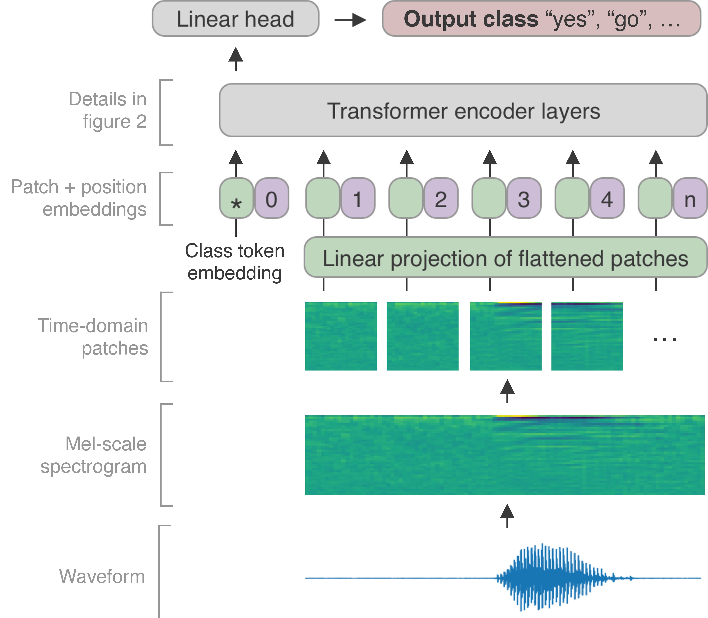

# Keyword Transformer: A Self-Attention Model for Keyword Spotting



This is the official repository for the paper [Keyword Transformer: A Self-Attention Model for Keyword Spotting](https://arxiv.org/abs/2104.00769), presented at Interspeech 2021. Consider citing our paper if you find this work useful.

```
@inproceedings{berg21_interspeech,
  author={Axel Berg and Mark O’Connor and Miguel Tairum Cruz},
  title={{Keyword Transformer: A Self-Attention Model for Keyword Spotting}},
  year=2021,
  booktitle={Proc. Interspeech 2021},
  pages={4249--4253},
  doi={10.21437/Interspeech.2021-1286}
}
```

## Setup

### Download Google Speech Commands

There are two versions of the dataset, V1 and V2. To download and extract dataset V2, run:

```shell
wget https://storage.googleapis.com/download.tensorflow.org/data/speech_commands_v0.02.tar.gz
mkdir data2
mv ./speech_commands_v0.02.tar.gz ./data2
cd ./data2
tar -xf ./speech_commands_v0.02.tar.gz
cd ../
```

And similarly for V1:

```shell
wget http://download.tensorflow.org/data/speech_commands_v0.01.tar.gz
mkdir data1
mv ./speech_commands_v0.01.tar.gz ./data1
cd ./data1
tar -xf ./speech_commands_v0.01.tar.gz
cd ../
```

### Install dependencies

Set up a new virtual environment:

```shell
pip install virtualenv
virtualenv --system-site-packages -p python3 ./venv3
source ./venv3/bin/activate
```

To install dependencies, run

```shell
pip install -r requirements.txt
```

Tested using Tensorflow 2.4.0rc1 with CUDA 11.

**Note**: Installing the correct Tensorflow version is important for reproducibility! Using more recent versions of Tensorflow results in small accuracy differences each time the model is evaluated. This might be due to a change in how the random seed generator is implemented, and therefore changes the sampling of the "unknown"  keyword class.

## Model
The Keyword-Transformer model is defined [here](kws_streaming/models/kws_transformer.py). It takes the mel scale spectrogram as input, which has shape 98 x 40 using the default settings, corresponding to the 98 time windows with 40 frequency coefficients.

There are three variants of the Keyword-Transformer model:

* **Time-domain attention**: each time-window is treated as a patch, self-attention is computed between time-windows
* **Frequency-domain attention**: each frequency is treated as a patch self-attention is computed between frequencies
* **Combination of both**: The signal is fed into both a time- and a frequency-domain transformer and the outputs are combined
* **Patch-wise attention**: Similar to the vision transformer, it extracts rectangular patches from the spectrogram, so attention happens both in the time and frequency domain simultaneously.

## Training a model from scratch
To train KWT-3 from scratch on Speech Commands V2, run  

```shell
sh train.sh
```

Please note that the train directory (given by the argument  `--train_dir`) cannot exist prior to start script.

The model-specific arguments for KWT are:

```shell
--num_layers 12 \ #number of sequential transformer encoders
--heads 3 \ #number of attentions heads
--d_model 192 \ #embedding dimension
--mlp_dim 768 \ #mlp-dimension
--dropout1 0. \ #dropout in mlp/multi-head attention blocks
--attention_type 'time' \ #attention type: 'time', 'freq', 'both' or 'patch'
--patch_size '1,40' \ #spectrogram patch_size, if patch attention is used
--prenorm False \ # if False, use postnorm
```

## Training with distillation

We employ hard distillation from a convolutional model (Att-MH-RNN), similar to the approach in [DeIT](https://github.com/facebookresearch/deit).

To train KWT-3 with hard distillation from a pre-trained model, run

```shell
sh distill.sh
```

## Run inference using a pre-trained model

Pre-trained weights for KWT-3, KWT-2 and KWT-1 are provided in ./models_data_v2_12_labels.

|Model name|embedding dim|mlp-dim|heads|depth|#params|V2-12 accuracy|pre-trained|
|:-:|:-:|:-:|:-:|:-:|:-:|:-:|:-:|
|KWT-1|64|128|1|12|607K|97.7|[here](models_data_v2_12_labels/kwt1)|
|KWT-2|128|256|2|12|2.4M|98.2|[here](models_data_v2_12_labels/kwt2)|
|KWT-3|192|768|3|12|5.5M|98.7|[here](models_data_v2_12_labels/kwt3)|

To perform inference on Google Speech Commands v2 with 12 labels, run

```shell
sh eval.sh
```

## Acknowledgements

The code heavily borrows from the [KWS streaming work](https://github.com/google-research/google-research/tree/master/kws_streaming) by Google Research. For a more detailed description of the code structure, see the original authors' [README](kws_streaming/README.md).

We also exploit training techniques from [DeiT](https://github.com/facebookresearch/deit).

We thank the authors for sharing their code. Please consider citing them as well if you use our code.

## License

The source files in this repository are released under the [Apache 2.0](LICENSE.txt) license.

Some source files are derived from the [KWS streaming repository](https://github.com/google-research/google-research/tree/master/kws_streaming) by Google Research. These are also released under the Apache 2.0 license, the text of which can be seen in the LICENSE file on their repository.
